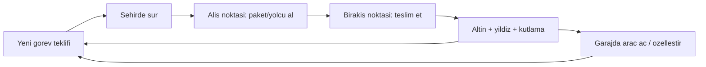

# Oyun Tasarım Dokümanı — Mete'nin Oyunu

## 1. Vizyon

5-12 yaş arası çocukların **tek parmakla** oynayabildiği, yukarıdan bakışlı (GTA 2 kamera tarzı,
ama tamamen çocuk dostu) bir şehir sürüş oyunu. Oyuncu şehirde araba sürer, yardımseverlik
temalı görevleri tamamlar, altın ve yıldız kazanır, garajında yeni araçlar açar.

**Tasarım sütunları:**

1. **Kolay kontrol** — gaz otomatik, çocuk sadece yön verir. Okuma bilmeyen 5 yaş bile oynayabilmeli.
2. **Kaybetmek yok** — görevler asla "başarısız" olmaz. Süreli görevlerde süre biterse ödül azalmaz,
   sadece hızlı bitirince bonus yıldız verilir. Çarpışmada ceza yok, araç yavaşlar ve devam eder.
3. **Sürekli ödül hissi** — kısa görevler (30-90 saniye), her görev sonunda kutlama, görünür ilerleme.
4. **Güvenli içerik** — şiddet yok, reklam yok, satın alma yok, internet gerekmez.

## 2. Hedef Kitle ve Oturum

- **Yaş:** 5-12 (ağırlık 6-9)
- **Oturum süresi:** 5-15 dakika
- **Cihazlar:** iPhone (SE ve üzeri), iPad — yatay (landscape) yönelim

## 3. Çekirdek Döngü

## 4. Kontroller

| Girdi | Aksiyon |
|---|---|
| Sol alt buton (basılı tut) | Sola dön |
| Sağ alt buton (basılı tut) | Sağa dön |
| GERİ butonu (basılı tut) | Yavaşla, sonra geri git |
| BİP butonu (basılı tut) | Korna — yakındaki yayalar zıplar |
| — | Gaz otomatik: araç kendiliğinden ilerler |

Editörde test için: ok tuşları / A-D / S / Boşluk / **H** (korna).

Tasarım notu: iki büyük buton, joystick'ten daha güvenilirdir — küçük çocuklar joystick'i
sürüklerken parmak kaydırıp kaybeder. Butonlar ekranın alt köşelerinde, başparmak boyunda.

## 5. Kamera

- Yukarıdan, ~63° eğimli, kuzeyi sabit (dönmeyen) kamera — GTA 2 hissi ama 3D derinlik görünür.
- Araç hızlandıkça hafif ileri bakış (look-ahead) — çocuk gideceği yeri görür.
- Yumuşatılmış takip (SmoothDamp), ani sarsıntı yok.

## 6. Şehir

- Grid tabanlı prosedürel şehir: 6×6 blok, ~226 m × 226 m.
- Yollar (sağ şerit), kaldırımlar, şerit çizgileri, yaya geçitleri, pastel binalar, parklar.
- Kavşaklarda trafik lambaları: tüm kavşaklar aynı fazı paylaşır (kuzey-güney yeşil, sonra doğu-batı). NPC'ler durur; oyuncu durmak zorunda değildir. İlk kez kırmızıda yavaşça durursa günde bir kez "+1 yıldız, dikkatli sürüş" ödülü.
- ~16 NPC araç şerit takip eder, ışığa uyar, birbirine ve oyuncuya mesafe bırakır, kavşakta döner. Çarpınca kaza/takla yok — oyuncu yavaşlar, onlar yoluna devam eder.
- ~24 yaya kaldırımda yürür, yeşil yanınca karşıya geçer. Oyuncu yaklaşınca kenara zıplar. Çarpmak oyunu bitirmez.
- Kaldırım kenarında park halindeki arabalar (şeridi tıkamaz).
- Şehrin çevresi çit/çalı ile kapalı — düşmek veya kaybolmak imkânsız.
- Sabit tohum (seed) ile üretilir: şehir her oyunda aynı kalır, çocuk yolları ezberleyip
  "benim şehrim" hissi yaşar. (İleride yeni bölgeler yeni seed ile eklenebilir.)
- Yol ağı verisi görev üreticisine ve trafik AI'sine açılır: alış/bırakış noktaları her zaman yol üzerindedir.
- Görev teklifi açıkken oyuncu aracı durur; şehir (trafik ve yayalar) yaşamaya devam eder.

## 7. Görev Sistemi

### Görev türleri

| Tür | Akış | Örnek metin |
|---|---|---|
| Kurye | Paketi al → adrese götür | "Paketi fırına teslim et!" |
| Taksi | Yolcuyu al → evine bırak | "Yolcuyu evine bırak!" |
| Hayvan kurtarma | Kayıp hayvanı bul → sahibine götür | "Kayıp kediyi sahibine götür!" |
| Okul servisi | Öğrenciyi al → okula bırak | "Öğrenciyi okula yetiştir!" |
| Hızlı teslimat | Kurye + süre bonusu | "Hızlı ol, bonus yıldız kazan!" |

### Üretim kuralları

- Görevler **prosedürel** üretilir: tür + rastgele alış/bırakış noktası + mesafeye göre ödül.
- **Günlük tohum:** her günün görevleri o günün tarihinden türetilen seed ile üretilir —
  "sürekli değişen görevler" hissi. Günde 5 hedef görev vardır; 5/5 olunca "bonus görevler"
  başlar, oyun asla durmaz.
- Alış-bırakış mesafesi 60-160 m aralığında tutulur (30-90 saniyelik görevler).

### Ödüller

- Altın: `20 + mesafe/10` (5'e yuvarlanır) → tipik 25-40 altın.
- Yıldız: her görev 1 ⭐; süreli görevde hızlı bitirme +1 ⭐.
- Görev bitince kutlama: büyük "+25 ALTIN!" yazısı, ileride ses + konfeti (M4).

### Yönlendirme

- Ekranın üstünde hedefe dönen **ok** + metre cinsinden mesafe.
- Hedefte renkli ışık halkası + havada dönen/zıplayan işaret (uzaktan görünür).
- Okuma gerektirmez: ok + renk kodu yeterli (alış = turkuaz, bırakış = yeşil).

## 8. Ekonomi ve Garaj (M3)

### Araç kataloğu (plan)

| Araç | Fiyat | Özellik |
|---|---|---|
| Taksi | Başlangıç aracı | Dengeli |
| Minibüs | 300 | Geniş, yavaş |
| Kamyonet | 600 | Sağlam |
| Ambulans | 900 | Hızlı |
| İtfaiye | 1.200 | Büyük ve güçlü |
| Dondurma Kamyonu | 1.500 | Eğlenceli, müzikli (M4) |
| Yarış Arabası | 2.000 | En hızlı |

- Fiyatlar, günde 5 görev tamamlayan bir çocuğun **2-3 günde bir** yeni araç açabileceği şekilde ayarlıdır.
- **Özelleştirme:** renk paleti (8 renk, 50 altın/renk), ileride tekerlek ve çıkartmalar.
- Garaj ekranı: araçlar podyumda döner, kilitli araçlar silüet + fiyat gösterir.

## 9. Kayıt Sistemi

- Cihazda JSON dosyası (`Application.persistentDataPath/save.json`).
- Saklananlar: altın, yıldız, toplam görev sayısı, günlük görev sayacı + tarih,
  açılmış araçlar, seçili araç, araç renkleri.
- Kayıt anları: görev tamamlanınca, garajda işlem yapılınca, uygulama arka plana geçince.
- İnternet/hesap yok — çocuk gizliliği açısından en güvenli model.

## 10. Teknik Mimari

- **Unity 6.3 LTS + URP**, hedef 60 FPS.
- Sahneler: `Boot` (ana menü) → `City` (oyun) → `Garage` (M3).
- Sahne dosyaları neredeyse boştur; şehir, araç, kamera ve UI **çalışma zamanında koddan üretilir**.
  Böylece tüm oyun mantığı kod incelemesiyle takip edilebilir ve sahne birleştirme (merge) sorunları yaşanmaz.
- İlk prototip görselleri Unity primitive'leri (kutu, silindir, küre) ile kurulur;
  M4'te Kenney/Meshy modelleriyle değiştirilir ([asset-pipeline.md](asset-pipeline.md)).
- Girdi: eski Input Manager (dokunma UI butonları + klavye) — sıfır yapılandırma; gerekirse M4'te Input System'e geçilir.

## 11. Çocuk Güvenliği ve App Store

- App Store **Made for Kids** (5 yaş altı / 6-8 / 9-11 kategorileri) hedeflenir.
- Reklam yok, IAP yok, dış bağlantı yok, analitik/veri toplama yok → COPPA ve
  Apple Kids Category kurallarına baştan uygun.
- Ebeveyn kapısı (parental gate) gerekmez çünkü dışa açılan hiçbir şey yok.

## 12. Ses ve Müzik (M4)

- Neşeli döngü müziği (telifsiz / lisanslı), motor vınlaması (hıza göre pitch),
  görev tamamlama jingle'ı, korna butonu (çocuklar bayılır).

## 13. Erişilebilirlik

- Okuma gerektirmeyen yönlendirme (ok + renk).
- Büyük dokunma hedefleri (min 120 pt).
- Titreşen/yanıp sönen efekt yok.
