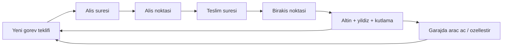

# Oyun Tasarım Dokümanı — Mete'nin Oyunu

## 1. Vizyon

5-12 yaş arası çocukların **tek parmakla** oynayabildiği, yukarıdan bakışlı (GTA 2 kamera tarzı,
ama tamamen çocuk dostu) bir şehir sürüş oyunu. Oyuncu şehirde araba sürer, yardımseverlik
temalı görevleri tamamlar, altın ve yıldız kazanır, garajında yeni araçlar açar.

**Tasarım sütunları:**

1. **Kolay kontrol** — ekrana basılı tut = gaz, kaydır = dön, bırak = fren. Okuma bilmeyen
   5 yaş bile oynayabilmeli.
2. **Kaybetmek yok** — görevler asla "başarısız" olmaz. Süre bitse de teslim edilir; ödülün
   zamanında kısmı kaçar, görev batmaz. Çarpışmada ceza yok, araç yavaşlar ve devam eder.
3. **Sürekli ödül hissi** — kısa görevler (yaklaşık 50-90 saniye, iki bacak), her görev sonunda
   kutlama, görünür ilerleme, üst üste zamanında bitirme serisi.
4. **Güvenli içerik** — şiddet yok, reklam yok, satın alma yok, internet gerekmez.

Bağlam özeti ve kod haritası: [progress.md](progress.md).

## 2. Hedef Kitle ve Oturum

- **Yaş:** 5-12 (ağırlık 6-9)
- **Oturum süresi:** 5-15 dakika
- **Cihazlar:** iPhone (SE ve üzeri), iPad — yatay (landscape) yönelim

## 3. Çekirdek Döngü

## 4. Kontroller

| Girdi | Aksiyon |
|---|---|
| Ekrana basılı tut | Gaz |
| Sağa / sola kaydır | Direksiyon |
| Parmağı kaldır | Fren |
| Sol alt GERİ (basılı tut) | Geri vites (sıkışınca) |
| Sağ alt BİP | Korna — yakındaki yayalar zıplar |

Editörde test için: **W / Yukarı ok** gaz, A-D direksiyon, S geri, **H** korna.

Tasarım notu: tek parmak, tüm ekran. Küçük çocuk joystick aramaz; bastığı yer gaz, kaydırdığı yön dönüş.

## 5. Kamera

- Yukarıdan, ~63° eğimli, kuzeyi sabit (dönmeyen) kamera — GTA 2 hissi ama 3D derinlik görünür.
- Araç hızlandıkça hafif ileri bakış (look-ahead) ve FOV 50→58 — hız hissi, sarsıntı yok.
- Yumuşatılmış takip (SmoothDamp).

## 6. Şehir

- Grid tabanlı prosedürel şehir: 6×6 blok, ~226 m × 226 m.
- Yollar (sağ şerit), kaldırımlar, şerit çizgileri, yaya geçitleri, pastel binalar, parklar.
- Kavşaklarda trafik lambaları: tüm kavşaklar aynı fazı paylaşır (kuzey-güney yeşil, sonra doğu-batı). NPC'ler durur; oyuncu durmak zorunda değildir. İlk kez kırmızıda yavaşça durursa günde bir kez "+1 yıldız, dikkatli sürüş" ödülü.
- ~16 NPC araç şerit takip eder, ışığa uyar, birbirine ve oyuncuya mesafe bırakır, kavşakta döner. Çarpınca kaza/takla yok — oyuncu yavaşlar, onlar yoluna devam eder.
- ~24 yaya kaldırımda yürür, yeşil yanınca karşıya geçer. Oyuncu yaklaşınca kenara zıplar. Çarpmak oyunu bitirmez.
- Kaldırım kenarında park halindeki arabalar (şeridi tıkamaz).
- Şehrin çevresi çit/çalı ile kapalı — düşmek veya kaybolmak imkânsız.
- Sabit tohum (seed) ile üretilir: şehir her oyunda aynı kalır, çocuk yolları ezberleyip
  "benim şehrim" hissi yaşar. (İleride yeni bölgeler yeni seed ile eklenebilir.)
- Yol ağı verisi görev üreticisine ve trafik AI'sine açılır: alış/bırakış noktaları her zaman yol üzerindedir.
- Görev teklifi açıkken oyuncu aracı durur; şehir (trafik ve yayalar) yaşamaya devam eder.

## 7. Görev Sistemi

### Görev türleri

| Tür | Akış | Süre karakteri |
|---|---|---|
| Kurye | Paketi al → adrese götür | Dengeli |
| Taksi | Yolcuyu al → evine bırak | Dengeli |
| Hayvan kurtarma | Kayıp hayvanı bul → sahibine götür | Biraz daha bol süre |
| Okul servisi | Öğrenciyi al → okula bırak | Biraz daha sıkı |
| Hızlı teslimat | Paketi al → çabuk götür | En sıkı süre |

### İki aşamalı geri sayım

Her görevde **iki ayrı süre** vardır; BAŞLA'dan sonra ekranda **bir tanesi** görünür:

1. **AL** — görevi aldıktan sonra ilk adrese (alış halkası) kadar. Noktalar: ● ○
2. **TESLİM** — alıştan sonra teslimat halkasına kadar. Noktalar: ● ●

Süre; bacak mesafesi, görev türü ve **Kolay / Orta / Zor** ile hesaplanır
(`MissionClock`: ~6 m/s seyir + 18 sn tampon, en az 25 sn, 5'e yuvarlanır).
Teklif kartında zorluk ve her iki süre de yazılır. Zor görevler +10 altın.

Sayaç yeşil → sarı → kırmızı; süre dolunca **0:00 GEÇ** yazar, nabız atar.
**Süre bitmek görevi iptal etmez** — çocuk yine teslim eder, o bacak için zamanında yıldızı alamaz.

### Üretim kuralları

- Görevler **prosedürel** üretilir: tür + rastgele alış/bırakış + mesafe/tür/zorluk süresi + ödül.
- **Günlük tohum:** her günün görevleri o günün tarihinden türetilen seed ile üretilir.
  Günde 5 hedef görev vardır; 5/5 olunca "bonus görevler" başlar, oyun asla durmaz.
- Alış-bırakış mesafesi 60-160 m aralığında tutulur.

### Ödüller

- Altın: `20 + toplamMesafe/10` (5'e yuvarlanır); Zor ise +10.
- Yıldız: her tamamlanan görev **1**; her zamanında bacak **+1** (ikisi de zamanındaysa 3 yıldız).
- Zamanında bacak: +5 altın. İkisi de zamanındaysa **seri** artar, `+5 × seri` altın daha.
- Seri bir bacak gecikince sıfırlanır. HUD'da `SERİ ×N` (N≥2), kayıtta `currentStreak` / `bestStreak`.
- Alışta toast: "ZAMANINDA! ALDIN!" veya "ALDIN!". Teslimatta büyük kutlama yazısı + akor.

### Yönlendirme

- Ekranın üstünde **büyük sarı ok** (siyah gölgeli, nabız gibi büyür) + metre.
  12 m içinde yazı **HEMEN YANINDA!** olur.
- Hedefte geniş halka, ışık sütunu ve büyük zıplayan ikon.
- Araç üstünde 3D yön oku **yok** (karışıyordu).
- Okuma gerektirmez: ok + renk kodu yeterli (alış = turkuaz, bırakış = yeşil).
- Sol üst para: sarı sikke + **ALTIN**, beş köşeli yıldız + **YILDIZ**.

## 8. Ekonomi ve Garaj (M4)

### Araç kataloğu (plan)

| Araç | Fiyat | Özellik |
|---|---|---|
| Taksi | Başlangıç aracı | Dengeli |
| Minibüs | 300 | Geniş, yavaş |
| Kamyonet | 600 | Sağlam |
| Ambulans | 900 | Hızlı |
| İtfaiye | 1.200 | Büyük ve güçlü |
| Dondurma Kamyonu | 1.500 | Eğlenceli, müzikli (M5) |
| Yarış Arabası | 2.000 | En hızlı |

- Fiyatlar, günde 5 görev tamamlayan bir çocuğun **2-3 günde bir** yeni araç açabileceği şekilde ayarlıdır.
- **Özelleştirme:** renk paleti (8 renk, 50 altın/renk), ileride tekerlek ve çıkartmalar.
- Garaj ekranı: araçlar podyumda döner, kilitli araçlar silüet + fiyat gösterir.

## 9. Kayıt Sistemi

- Cihazda JSON dosyası (`Application.persistentDataPath/save.json`).
- Saklananlar: altın, yıldız, toplam görev, günlük sayaç + tarih, nezaket yıldızı bayrağı,
  zamanında seri (`currentStreak`, `bestStreak`), açılmış araçlar, seçili araç.
- Kayıt anları: görev tamamlanınca, nezaket ödülünde, uygulama arka plana geçince.
- İnternet/hesap yok — çocuk gizliliği açısından en güvenli model.

## 10. Teknik Mimari

- **Unity 6.3 LTS + URP**, hedef 60 FPS.
- Sahneler: `Boot` (ana menü) → `City` (oyun) → `Garage` (M4).
- Sahne dosyaları neredeyse boştur; şehir, araç, kamera ve UI **çalışma zamanında koddan üretilir**.
  Böylece tüm oyun mantığı kod incelemesiyle takip edilebilir ve sahne birleştirme (merge) sorunları yaşanmaz.
- İlk prototip görselleri Unity primitive'leri (kutu, silindir, küre) ile kurulur;
  M5'te Kenney/Meshy modelleriyle değiştirilir ([asset-pipeline.md](asset-pipeline.md)).
- Girdi: eski Input Manager (dokunma UI + klavye) — sıfır yapılandırma.
- Cloud Agent Unity Editor çalıştırmaz; görsel playtest Mac'te yapılır.

## 11. Çocuk Güvenliği ve App Store

- App Store **Made for Kids** (5 yaş altı / 6-8 / 9-11 kategorileri) hedeflenir.
- Reklam yok, IAP yok, dış bağlantı yok, analitik/veri toplama yok → COPPA ve
  Apple Kids Category kurallarına baştan uygun.
- Ebeveyn kapısı (parental gate) gerekmez çünkü dışa açılan hiçbir şey yok.

## 12. Ses ve Müzik

Şimdilik dosyasız prosedürel ses: korna (BİP), alış ding, teslimat akoru, BAŞLA tonu.
M5'te: neşeli döngü müziği, motor vınlaması (hıza göre pitch), konfeti.

## 13. Erişilebilirlik

- Okuma gerektirmeyen yönlendirme (ok + renk); süre rakamları büyük.
- Büyük dokunma hedefleri (min 120 pt).
- Titreşen/yanıp sönen efekt yok (sayaç nabzı hafif ölçek, strobe değil).
